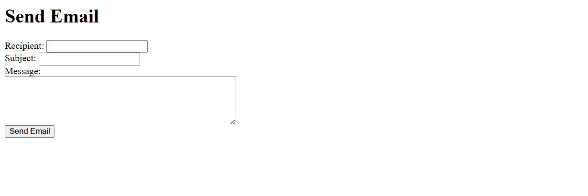
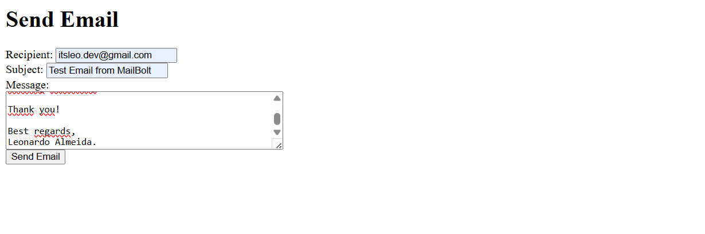
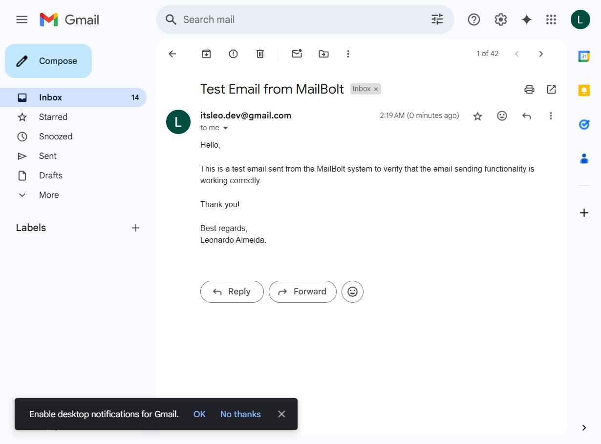

<a id="readme-top"></a>

<div> 
  <a href="https://www.youtube.com/@AlmeidaVerse" target="_blank"></a>
  <a href = "mailto:almeidaleo.dev@gmail.com"></a>
  <a href="https://www.linkedin.com/in/almeidaleo-dev/" target="_blank"></a> 
</div>

<br />

<!-- PROJECT LOGO -->
<div align="center">
  <a href="https://github.com/AlmeidaLeoDev/MailBolt">
    
  </a>
  <h3 align="center">MailBolt</h3>
</div>

<div>
  <div align="center">
    A simple Node.js application to send emails programmatically using Nodemailer.
  </div>

  <div align="center">
    <a href="#about-the-project"><strong>Explore the docs »</strong></a>
  
  <p>
    <br />
    <a href="#usage">View Demo</a>
  </p>
</div>


<!-- TABLE OF CONTENTS -->
<details>
  <summary>Table of Contents</summary>
  <ol>
    <li>
      <a href="#about-the-project">About The Project</a>
      <ul>
        <li><a href="#built-with">Built With</a></li>
        <li><a href="#dependencies">Dependencies</a></li>
      </ul>
    </li>
    <li>
      <a href="#getting-started">Getting Started</a>
      <ul>
        <li><a href="#prerequisites">Prerequisites</a></li>
        <li><a href="#installation">Installation</a></li>
      </ul>
    </li>
    <li><a href="#usage">Usage</a></li>
    <li>
      <a href="#contributing">Contributing</a>
      <ul>
        <li><a href="#top-contributors">Top contributors</a></li>
      </ul>
    </li>
  </ol>
</details>


<!-- ABOUT THE PROJECT -->
## About The Project

A simple Node.js application to send emails programmatically using Nodemailer.

Main Objectives:

* Integrate Nodemailer
  * Configure the module to send emails via SMTP (Gmail).
  * Support plain text and HTML emails.
* Implement Security Best Practices
  * Use App Passwords (2FA-enabled Gmail accounts).
  * Protect sensitive data with environment variables (.env).
  * Basic error handling for failed email delivery.
* Build an API with Express.js

</br>

### Built With

[](https://nodejs.org/en)
[](https://developer.mozilla.org/en-US/docs/Web/JavaScript)
[](https://developer.mozilla.org/en-US/docs/Web/HTML)
[](https://developer.mozilla.org/en-US/docs/Web/CSS)

### Dependencies

* express: 5.1.0
* nodemailer: 7.0.3
* body-parser: 2.2.0
* ejs: 3.1.10
* dotenv: 16.5.0

<br />
<p align="left">(<a href="#readme-top">Back to top</a>)</p>
<br />


<!-- GETTING STARTED -->
## Getting Started

Instructions on how you can set up your project locally.

### Prerequisites

* Git: To clone the repository.
* Node.js
* npm
* Gmail account (with 2FA enabled for App Password)


### Installation

Below you will find instructions on how to install and configure your application.

**1. Clone the Repository**

Open your terminal and run:

```bash
git clone https://github.com/AlmeidaLeoDev/MailBolt
```
Then navigate to the project directory:
```bash
cd EventosPro
```
<p></p>

**2. Install dependencies**

<p></p>

**3. Create a .env file**

<p></p>

**4. Configuration**

* Enable 2FA on your Google account
* Generate an App Password
  * Go to Google Account > Security > App Passwords
  * Select "Other" and name it (e.g., "NodeMailer App")
  * Copy the generated 16-character password

<p></p>

**5. Start the server**

<br />
<p align="left">(<a href="#readme-top">Back to top</a>)</p>
<br />


<!-- USAGE -->
## Usage

Demonstration of how the project can be used

<div align="left">

**1. Start the server**

```bash
node app.js
```

**2. Open the web interface**

* Go to http://localhost:3000 in your browser."
* You’ll see a form with fields for:
  * Recipient’s email address.
  * Subject line.
  * Message body.



**3. Send the email**

* Click "Send Email" to submit the form.
* The server will process your request and attempt to deliver the email via Gmail’s SMTP.



**4. Expected outcome**

* On success
  * You’ll see a confirmation message: "Email sent successfully!".
  * The recipient will receive your email in their inbox (check spam folder if missing).
  

* On error
  * An error message will appear (e.g., "Error in sending email. Pleasey try again later.").

<br />
<p align="left">(<a href="#readme-top">Back to top</a>)</p>
<br />

<!-- CONTRIBUTING -->
## Contributing

### Top contributors

<table>
  <tr>
    <td align="center">
      <a href="https://www.linkedin.com/in/almeidaleo-dev/" target="_blank">
        <br>
        <sub>
          <b>Leonardo Almeida</b>
        </sub>
      </a>
    </td>
</table>

<br />
<p align="left">(<a href="#readme-top">Back to top</a>)</p>
<br />